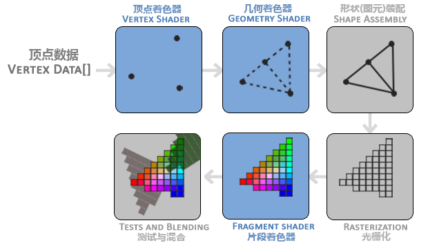
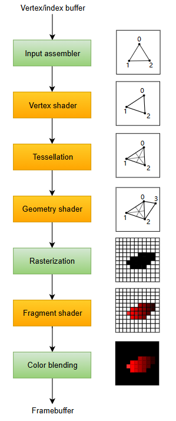

# 1. 流程介绍

## 1.1 OpenGL Version

# 1.2 Vulkan Version

# 2. OpenGL: Render Pipeline

## 2.1 顶点数据
OpenGL 的顶点数据有两种组织形式：
1. 基于 Vertex 的：根据选择的图元类型，在 Vertex Buffer 中，从 offset 开始，向后依次读入 N（Triangle：N = 3） 个TYPE（float） 类型的数据，作为顶点属性
2. 基于 Index 的：根据选择的图元类型，在 Index Buffer 中，从 offset 开始，向后依次读入 N 个 UINT 类型的数据，作为顶点的索引。然后使用索引值去 Vertex Buffer 中读取对应数据，作为顶点属性
3. Vertex Attribute：顶点属性：如 Position、Color、Normal等，在 OpenGL 中，顶点属性也存储在 Vertex Buffer 中，并通过 Attribute Pointer 进行分配。在处理 Vertex Attribute 和 Vertex Buffer 时，需要注意，把 Attribute 和 Vertex 处理成一一对应的关系，这与 OBJ 文件的存储格式不相容，我们需要手动把 f x/x/x x/x/x x/x/x 进行修整，整理为 f x x x 的格式，这会浪费一些空间

## 2.2 Vertex Shader
Vertex Shader 的处理对象是一个 Vertex Data（顶点数据）。上面也提到了，顶点数据由若干个顶点属性构成

所以 Vertex Shader 的输入是 ：一个 Vertex 的若干属性

而 Vertex Shader 的输出是： Clip 空间的坐标

在 Vertex Shader 中，我们需要做的主要工作是： 经过 Model， View， Projection 变换，把坐标从 模型的局部空间，变换至 世界空间，再 变换至相机空间，最后变换至投影空间（clip）空间

当然还有一些次要工作：将 Vertex 的其他属性（如：Normal， uv， Color 等信息）做出一些变换后传递至下一阶段：Gemoetry Shader 、Fragment Shader

## 2.3 Geometry Shader
Geometry Shader 的输入是：一个图元（可以是一个点，也可以是一个三角形）的顶点列表
在 Geometry Shader 中，可以任意的：

1. 修改输入顶点的坐标位置
2. 新增新的顶点组成更多的图元
3. 新增新的顶点将组合成不同的图元，输入到下一个阶段

输出则是图元的类型信息，和顶点数据

## 2.4 图元装配
在该阶段会根据 Gemotry Shader 提供的输出将 Vertex Data 组装成新的图元，传递至下一个阶段，进行光栅化

## 2.5 光栅化 Rasterization
### 2.5.1 光栅化阶段的裁剪与剔除

1. Cilp -> NDC 发生的剔除(透视除法)：
（1）执行透视除法前，坐标中的 w 分量含义是：view space 中该点的 z 坐标，可以通过 w 分量判断该点位于视锥前还是视锥后
（2）执行透视除法后，坐标会从（x, y, z, w）变成 (x/w, y/w, z/w, 1)，其中 x/w， y/w， z/w 的范围是 （-1，1），在光栅化之后，拿到一个像素对应的 NDC 坐标后，我们能通过该坐标是否位于 （-1，1）范围内，来决定是否将其丢弃
（3）真正到 Fragment Shader 时，顶点的坐标会变成屏幕空间的坐标

2. 面剔除（背面剔除）：通过判断面的法向是否和视线方向相同，对三角形进行剔除，以减轻 Fragment Shader 的负担

3. Early-z：通过提前对比 Depth-Map 中的深度值和当前像素的深度值，来决定该像素是否丢弃

### 2.5.2 光栅化
光栅化阶段的任务主要有两个：

1. 确认图元覆盖了哪些像素，以及哪些像素需要被丢弃
2. clip 坐标 -> NDC 坐标，确认像素写入的位置

光栅化将图元分解为一个个像素，然后将 Fragment Shader 的输入准备好，对顶点属性进行插值，然后将输入送入 Fragment Shader

## 2.6 Fragment Shader
又叫 Pixel Shader，负责计算每个 Pixel 最终的颜色值，并输出。

在前向渲染的过程中，pixel shader 中会利用所有能用到的信息进行计算，最终输出计算得到的颜色。

在延迟渲染的过程中，pixel shader 会作为一个数据的中转站，将插值后得到的各个属性输出到一个叫做 G-Buffer 的 FrameBuffer 上

## 2.7 混合与测试

Fragment Shader 输出的结果会依次通过：模板测试（stencil test）-> 深度测试 -> 混合。

### 2.7.1 混合：
是针对半透明物体提出的渲染技术，通过从后往前依次叠加位于同一像素上的颜色值，实现可以透过半透明物体观察到不透明物体的视觉效果

要实现混合需要使用 Pre-Depth 作为支持，需要首先渲染不透明物体的Depth-Buffer，用作深度测试，以防止出现半透明物体遮挡不透明物体的情况

然后渲染半透明物体时要关闭深度写入，并开启深度测试，此时想要正确处理半透明物体的渲染顺序，仍然需要额外的操作：对半透明物体进行排序。

### 2.7.2 透明度测试：
为了提升渲染效率，可以忽略掉一些透明度很低 fragment，将其丢弃。

# 3. Vulkan：Render Pipeline

vulkan 的 Pipeline 与 OpenGL 给出的 Pipeline 相比：

1. 在 Vertex Shader 前多了一个 Input Assembler 阶段

2. 多了一个 Tessellation Shader

3. 少了一个 Shape Assembly

## 3.1 Input Assembler阶段

从原始的 Vertex Buffer 中收集 Vertex Data， 或使用 Index Buffer 从 Vertex Buffer 中重复获取某个元素而无需复制

## 3.2 Tessellation Shader

允许进行几何细分来提高 Mesh 的质量

## 3.3 Shape Assembly

主要是将顶点装配成图元，并为不同的图元选择不同的光栅化算法

# 4. 前向渲染与延迟渲染